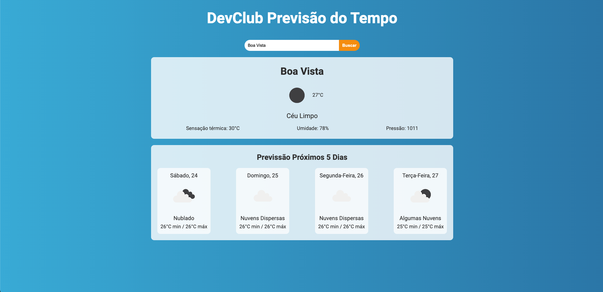

# Previssão do tempo

## Pequena aplicação para fins de conhecimento

Esse é um projeto em React com TypeScript, nele foi utilizado para a realização das requisições a biblioteca do axios e para a componentização dos componentes o styled-components.

Essa aplicação tem o intuito somente de exibir para o usuário a previssão do tempo da cidade de sua escolha. É utilizado a api do OpenWeather que trás as informações do tempo da cidade e a previssão para os próximos 5 dias, segue o link logo abaixo:

- [OpenWeather](https://openweather.co.uk/products)

> Para rodar o projeto você deve:

- Ter o node na versão >= 18.18.0
- Criar uma conta no [OpenWeather](https://openweather.co.uk/products), após criar a conta você terá um key, crie um arquivo `env.ts` na raiz da pasta `src`, cole ela a chave e exporta ela com o nome **API_KEY**
- Execute o comando `yarn` no terminal
- Após baixar as bibliotecas, no mesmo terminal execute o comanda `yarn dev`
- Acesse o endereço que irá aparecer no terminal

